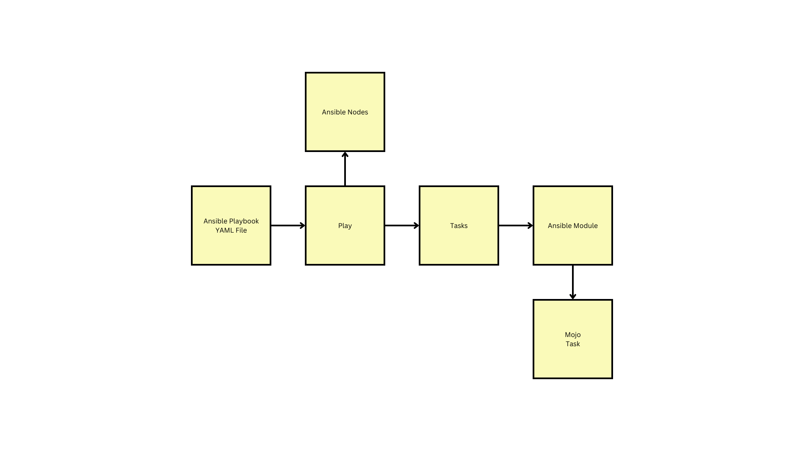

# Day 4

## Info - Ansible Playbook Structure


## Lab - Listing all the modules ansible supports
```
ansible-doc -l
```

Expected output


## Lab - Finding syntax details of a particular ansible module
```
ansible-doc service
ansible-doc shell
ansible-doc yum
ansible-doc apt
ansible-doc file
ansible-doc template
ansible-doc copy
ansible-doc command
```
Exptected output


## Lab - Running your first ansible playbook
```
cd ~/devops-july-2024
git pull
cd Day4/ansible
cat ping-playbook.yml
ansible-playbook -i hosts ping-playbook.yml
```

Expected output


## Lab - Multiple Plays in a single Playbook
```
cd ~/devops-july-2024
git pull
cd Day4/ansible
cat multiple-play-in-a-playbook.yml
ansible-playbook -i hosts multiple-play-in-a-playbook.yml
```
Expected output

## Info - SCRUM - Daily stand-up meeting
<pre>
- is an inspect and adapt meeting
- in other words, it is fail-fast meeting
- the team inspects the yesterday's plan against the real status as on yesterday
- if the team finds a deviation, if required the plan must be updated

</pre>

## Info - DevOps
<pre>
- Developers
  - they need to automate unit/integrating testing using Test Frameworks
    - developers are expected to learn little bit of QA skills
  - Test Frameworks
    - Developers should follow TDD(Test Driven Development)
    - Java
      - JUnit/TestNg/Mockito/PowerMock/EasyMock/JMock, etc
    - C/C++
      - CUnit, CppUnit, Google Test/Mock
    - JavaScript ( Angular, NodeJS )
      - Jasmine, Karma
    - Python
      - PyTest
    - C#
      - NUnit/MSTest/Moq
- QA
  - they need to automate e2e functionality test, API Test, Stress/Load Test, Regression Test, Sanity Check, Smoke Test
  - the test automation expects to convert the testing effort into source code that can be pushed to Version control
  - QA folks are expected to learn little of development skills
  - Frameworks
    - Behaviour Driven Development Frameworks (BDD)
    - Cucumber, Specflow, Selenium, Raft
- System Administrators
  - they need to automate OS installation, provisioning, software installations, user management, etc
  - Provisioning
    - System Adminstrators are expected to use Infrastructure as a Code Tools like Cloudformation, Terraform, Docker, Vagrant, etc.,
    - System Administrators are expected to use Configuration Management Tools like Ansible, Puppet/Chef, etc to install softwares on an existing Virtual Machine or a OS on OnPrem environment(Private cloud), public cloud and Hybrid Cloud
    - System Administrators also has to know coding
</pre>

## Info - Continuous Integration (CI)
<pre>
- the code developed by each developer is continuously integrated in the dev branch
- Jenkins or CI Build Server grabs the latest code and it is going run the build along with unit and integration test cases
- If any test case fails, the build will fail, all the test cases are passing then the build will pass
</pre>

## Info - Continuous Deployment (CD)
<pre>
- the CI certified application binaries are automatically deployed into QA environment for further QA automated test execution  
</pre>

## Info - Continuous Delivery (CD)
<pre>
- the QA certified release(application binaries) are deployed into customer's environment which is close to production environment ( pre-prod ) environment
- the Customer will verify the functionality and if the customer found the application is working as expected and found to be stable, they can decide if they can make it live in production environment
</pre>

