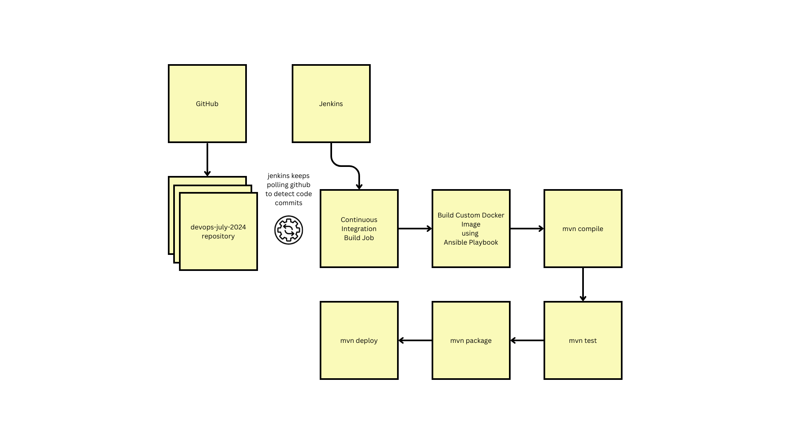

# Day 5
## Lab - Installing Docker and Ansible Jenkins Plugins

Click on "Manage Jenkins"

Click "Plugins"

Select "Available Plugins"

Search "Docker" and Select "Docker 1.6.2"

Search "Ansible" and Select "Ansible"

Click "Install"

Select check "Restart Jenkins when installation is complete and no jobs are running"

In case, you don't see any progress refresh your web browser page

To verify if Docker and Ansible Plugins are installed, navigate to "Manage Jenkins" --> "Plugins" --> "Installed Plugins" and Search for Docker

Clear Search and search for Ansible


Once you have confirmed that all necessary plugins are installed, let's go back to the Jenkins Dashboard landing page


## Lab - Creating a Maven style Jenkins Job

In the center of the Jenkins page click "Create a Job" or you may click "Create Item" from the menu shown in the left side.

As the Maven style Job is missing, we need to install "Maven Integration Plugin". Navigate to "Manage Jenkins" --> "Plugins" --> "Available Plugins" search for "Maven Integration" and install and restart.


From the landing page, let's click "Create a Job"

Select "Maven Project" and type "Hello Maven Jenkins Job" under Enter an item name

Click "ok" button


General Section


Source Code Management
Select "Git" and type https://github.com/tektutor/devops-july-2024.git under "Repository Url"
Under Branches to build, replace "master" with "main" branch


Triggers
Select "Poll SCM" and type "H/02 * * * *" under schedule


Build

Under "Root pom" we need to give the relative path where Jenkins can find the pom.xml
"Day3/maven/multi-module-project/pom.xml"

Under the "Goals and options" type "clean deploy"


Scroll down to click on "Save" button


## Lab - Creating a Freestyle Jenkins Job

Click "New item"

Type "Freestyle Jenkins Job" under the item name and select "Freestyle project"

Click "Ok" button


General section


Source Code Management
Type https://github.com/tektutor/devops-july-2024.git under repository url and replace "*/master" with "*/main" under Branch specifier


Build Triggers
Type "H/02 * * * *" under Poll SCM --> schedule


Build Steps


Select "Execute Shell"

Under the Execute Shell --> command type
```
cd Day3/maven/multi-module-project
mvn clean install
```


Click "Save" button


## Lab - Creating a FreeStyle Jenkins Job and triggering Ansible Playbook
Create a file name ~/.become-password-file and type 'rps' without quotes, save and close the file.


Click "New Item"

Type "Invoke Ansible Playbook" and Copy project from "Freestyle Jenkins Job"


Click "ok" button


Build Steps


Click "save" button


## Lab - Invoking Ansible Playing using Ansible Jenkins plugin

### Things to remember
<pre>
- Ansible searches for ansible.cfg as mentioned in the ANSIBLE_CONFIG environment variable
- In case you have exported the ANSIBLE_CONFIG environment variable, then ansible searches for ansible.cfg in the current directory
- In case, the ansible.cfg is not present in the current folder then ansible searches for .ansible.cfg under your home directory
- In case, the ~/.ansible.cfg is not found then ansible finally searches ansible.cfg under /etc/ansible/ansible.cfg folder
- In the above paths, wherever ansible finds the ansible.cfg first it picks it and ignores the other options.
</pre>

Copy the ansible.cfg from your Day4/ansible folder to your home directory
```
cd ~/devops-july-2024
git pull
cd Day4/ansible
cp ansible.cfg ~/.ansible.cfg
```


## Info - Jenkins Master-Slave Node Setup usecases
<pre>
- Currently used Jenkins is the Master Jenkins that comes with Web GUI
- We could add many slave Jenkins which are headless, they only instructions from Jenkins Master
- end-users will not able to give instructions or interact with Jenkins slave instances
- the main usecase of master-slave node setup is
  - to support executing parallel builds
  - to support running builds and testing in different OS environments
- the slave nodes can be ec2 instance running in aws, azure vm instances, or could on-prem virtual machine or physical machine or docker containers
- in our case, we are going to use docker containers as Jenkins slave nodes
</pre>

## Lab - Configuring Docker containers as Jenkins slave nodes

We need to configure the Docker Service (Service) - Do this in the terminal
```
sudo systemctl status docker
sudo gedit /usr/lib/systemd/system/docker.service
sudo systemctl daemon-reload
sudo systemctl restart docker
sudo systemctl status docker
```
Expected output


Save and exit


Manage Jenkins

Click on "Clouds"

New Cloud


Click "Create"

Expand "Docker Cloud details"


Scroll Down to see "Docker Agent Templates"

Add Docker Template


Click "Save" button


## Lab - Creating a CICD Pipeline


Let's create a declarative pipeline using Jenkinsfile

Click "New Item", let's create a Pipeline project and give it a name "CICD Pipeline"

Click "Ok" button

General


Build Triggers


Make sure you update the dockerimage as shown below
Under Manage Jenkins --> Clouds --> docker-jenkins-slave --> Docker Agent Templates --> Docker Image


Pipeline
<pre>
1. Pipeline --> Definition --> Select "Pipeline Script from SCM"
2. Under SCM --> Select Git
3. Repository URL - https://github.com/tektutor/devops-july-2024.git
4. Under Branch Specifier replace "*/master" with "*/main"
5. Under Script Path, change Jenkinsfile to Day5/CICD/Jenkinsfile
</pre>


Click "Save" button


Expected output


